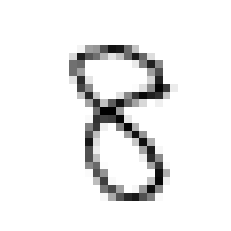
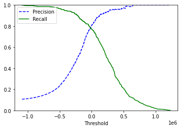
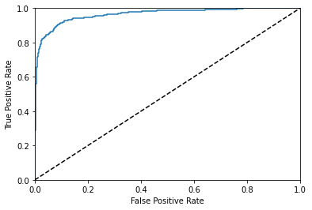
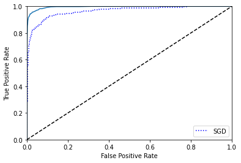
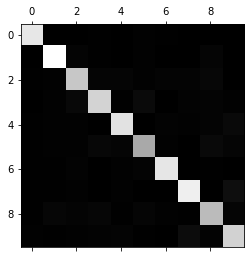
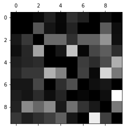
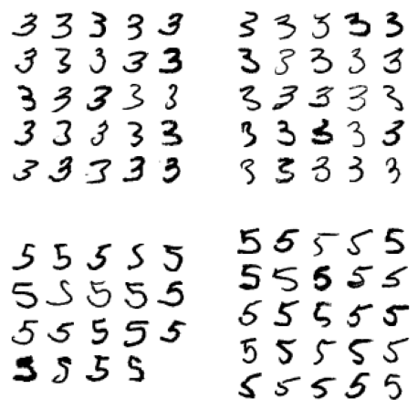

<h1>Table of Contents<span class="tocSkip"></span></h1>
<div class="toc"><ul class="toc-item"></ul></div>


```python
!tl -l
```

    zsh:1: command not found: tl


```python
from sklearn.datasets import fetch_openml
mnist = fetch_openml('mnist_784')

```


```python
X, y = mnist["data"],mnist["target"]
X.shape, y.shape
```


    ((70000, 784), (70000,))


```python
%matplotlib inline
import matplotlib
import matplotlib.pyplot as plt

some_digit = X[3600]
some_digit_image = some_digit.reshape(28,28)

plt.imshow(some_digit_image, cmap = matplotlib.cm.binary, interpolation = "nearest")
plt.axis("off")
plt.show()
```





```python
y[3600]
```


    '8'


```python
X_train, X_test, y_train, y_test = X[:6000], X[6000:], y[:6000], y[6000:]
```


```python
import numpy as np
shuffle_index = np.random.permutation(6000)
X_train, y_train = X_train[shuffle_index], y_train[shuffle_index]
```


```python
y_train_5 = (y_train == '5') # true for all 5s, False for all other digits
y_test_5 = (y_test == '5')

```


```python
y_train_5
```


    array([False,  True, False, ..., False, False, False])


```python
from sklearn.linear_model import SGDClassifier
sgd_clf = SGDClassifier(random_state = 42)
sgd_clf.fit(X_train, y_train_5)
```


    SGDClassifier(random_state=42)


```python
sgd_clf.predict([some_digit])
```


    array([ True])


```python
#使用交叉验证测量精度
from sklearn.model_selection import StratifiedKFold
from sklearn.base import clone 
skfolds = StratifiedKFold(n_splits = 3, random_state = 42)
for train_index, test_index in skfolds.split(X_train, y_train_5):
    clone_clf = clone(sgd_clf)
    X_train_folds = X_train[train_index]
    y_train_folds = (y_train_5[train_index])
    X_test_fold = X_train[test_index]
    y_test_fold = (y_train_5[test_index])
    
    clone_clf.fit(X_train_folds, y_train_folds)
    y_pred = clone_clf.predict(X_test_fold)
    n_correct = sum(y_pred == y_test_fold)
    print(n_correct / len(y_pred)) # prints 
```

    /home/squirrel/.pyenv/versions/3.8.1/lib/python3.8/site-packages/sklearn/model_selection/_split.py:293: FutureWarning: Setting a random_state has no effect since shuffle is False. This will raise an error in 0.24. You should leave random_state to its default (None), or set shuffle=True.
      warnings.warn(


    0.9575
    0.972
    0.9555


```python
from sklearn.model_selection import cross_val_score
cross_val_score(sgd_clf, X_train, y_train_5, cv = 3, scoring = "accuracy")

```


    array([0.9575, 0.972 , 0.9555])


```python
from sklearn.base import BaseEstimator
class Never5Classifier(BaseEstimator):
    def fit(self, X, y = None):
        pass
    def predict(self, X):
        return np.zeros((len(X), 1), dtype = bool)

```


```python
never_5_clf = Never5Classifier()
cross_val_score(never_5_clf, X_train, y_train_5, cv = 3, scoring = "accuracy")
```


    array([0.9135, 0.91  , 0.9195])


```python
from sklearn.model_selection import cross_val_predict
y_train_pred = cross_val_predict(sgd_clf, X_train, y_train_5, cv = 3)
```


```python
from sklearn.metrics import confusion_matrix
confusion_matrix(y_train_5, y_train_pred)
```


    array([[5397,   89],
           [ 141,  373]])


```python
y_train_5.shape,y_train_pred.shape
```


    ((6000,), (6000,))


```python
from sklearn.metrics import precision_score, recall_score
precision_score(y_train_5, y_train_pred),
```


    (0.8081632653061225,)


```python
recall_score(y_train_5, y_train_pred)
```


    0.7704280155642024


```python
from sklearn.metrics import f1_score
f1_score(y_train_5, y_train_pred)
```


    0.7888446215139443


```python
y_scores = sgd_clf.decision_function([some_digit])
y_scores
```


    array([-66755.32967637])


```python
threshold = 0
y_some_digit_pred = (y_scores > threshold)
y_some_digit_pred
```


    array([False])


```python
y_scores = cross_val_predict(sgd_clf, X_train, y_train_5, cv = 3, method = "decision_function")
```


```python
from sklearn.metrics import precision_recall_curve
precisions, recalls, thresholds = precision_recall_curve(y_train_5, y_scores)
```


```python
def plot_precision_recall_vs_threshold(precisions, recalls, thresholds):
    plt.plot(thresholds, precisions[:-1], 'b--', label = "Precision")
    plt.plot(thresholds, recalls[:-1], 'g-', label = "Recall")
    plt.xlabel("Threshold")
    plt.legend(loc = "upper left")
    plt.ylim([0,1])

plot_precision_recall_vs_threshold(precisions, recalls, thresholds)
plt.show()
```





```python
y_train_pred_90 = (y_scores > 0.5)

```


```python
precisoin_score(y_train_5, y_train_pred_90)

```


    ---------------------------------------------------------------------------
    
    NameError                                 Traceback (most recent call last)
    
    <ipython-input-41-e6350f9b44ad> in <module>
    ----> 1 precisoin_score(y_train_5, y_train_pred_90)


    NameError: name 'precisoin_score' is not defined


```python
from sklearn.metrics import roc_curve
fpr, tpr, thresholds = roc_curve(y_train_5, y_scores)
```


```python
def plot_roc_curve(fpr, tpr, label = None):
    plt.plot(fpr, tpr, label = None)
    plt.plot([0, 1], [0, 1], 'k--')
    plt.axis([0, 1, 0, 1])
    plt.xlabel('False Positive Rate')
    plt.ylabel('True Positive Rate')
    
plot_roc_curve(fpr, tpr)
plt.show()
```





```python
from sklearn.metrics import roc_auc_score
roc_auc_score(y_train_5, y_scores)
```


    0.9643471673917762


```python
from sklearn.ensemble import RandomForestClassifier
forest_clf = RandomForestClassifier(random_state = 42)
y_probas_forest = cross_val_predict(forest_clf, X_train,y_train_5, cv = 3, method = "predict_proba")
```


```python
y_scores_forest = y_probas_forest[:, 1] # score = proba of positive class
fpr_forest, tpr_forest, thresholds_forest = roc_curve(y_train_5, y_scores_forest)
plt.plot(fpr, tpr, "b:", label = "SGD")
plot_roc_curve(fpr_forest, tpr_forest, "Random Forest")
plt.legend(loc = "best")
plt.show()
```





```python
sgd_clf.fit(X_train, y_train) # y_trian, not y_trian_5
sgd_clf.predict([some_digit])
```


    array(['8'], dtype='<U1')


```python
some_digit_scores = sgd_clf.decision_function([some_digit])
some_digit_scores
```


    array([[-275040.2782015 , -389367.80855561, -232859.4646962 ,
            -105892.22463069, -492965.88577736,  -64099.84117026,
            -634962.93482432, -192929.18342674,   92587.07257706,
             -68984.92422856]])


```python
np.argmax(some_digit_scores)
```


    8


```python
sgd_clf.classes_
```


    array(['0', '1', '2', '3', '4', '5', '6', '7', '8', '9'], dtype='<U1')


```python
from sklearn.multiclass import OneVsOneClassifier
ovo_clf = OneVsOneClassifier(SGDClassifier(random_state = 42))
ovo_clf.fit(X_train, y_train)
ovo_clf.predict([some_digit])
```


    array(['8'], dtype=object)


```python
len(ovo_clf.estimators_)
```


    45


```python
forest_clf.fit(X_train, y_train)
forest_clf.predict([some_digit])
```


    array(['8'], dtype=object)


```python
forest_clf.predict_proba([some_digit])
```


    array([[0.02, 0.01, 0.05, 0.06, 0.06, 0.04, 0.02, 0.  , 0.73, 0.01]])


```python
cross_val_score(sgd_clf, X_train, y_train, cv = 3, scoring = "accuracy")
```


    array([0.88  , 0.8725, 0.866 ])


```python
y_probas_forest = cross_val_score(sgd_clf, X_train, y_train, cv = 3, method = "predict_proba")
```


    ---------------------------------------------------------------------------
    
    TypeError                                 Traceback (most recent call last)
    
    <ipython-input-69-b3aeb7c2622c> in <module>
    ----> 1 y_probas_forest = cross_val_score(sgd_clf, X_train, y_train, cv = 3, method = "predict_proba")


    ~/.pyenv/versions/3.8.1/lib/python3.8/site-packages/sklearn/utils/validation.py in inner_f(*args, **kwargs)
         70                           FutureWarning)
         71         kwargs.update({k: arg for k, arg in zip(sig.parameters, args)})
    ---> 72         return f(**kwargs)
         73     return inner_f
         74 


    TypeError: cross_val_score() got an unexpected keyword argument 'method'


```python
from sklearn.preprocessing import StandardScaler
scaler = StandardScaler()
X_train_scaled = scaler.fit_transform(X_train.astype(np.float64))
cross_val_score(sgd_clf, X_train_scaled, y_train, cv = 3, scoring = "accuracy")
```


    array([0.8885, 0.8985, 0.888 ])


```python
y_train_pred = cross_val_predict(sgd_clf, X_train_scaled, y_train, cv = 3)
conf_mx = confusion_matrix(y_train, y_train_pred)
conf_mx
```


    array([[577,   0,   4,   1,   1,   4,   2,   1,   2,   0],
           [  0, 631,  12,   2,   1,   6,   0,   0,  17,   2],
           [  3,   7, 491,  15,  17,   3,  11,   9,  21,   4],
           [  1,   9,  18, 510,   3,  34,   2,   9,  15,   7],
           [  3,   4,   7,   0, 553,   1,  10,   4,  11,  30],
           [  5,   5,   5,  28,  13, 416,  10,   2,  18,  12],
           [  3,   4,   5,   0,   7,  10, 574,   0,   5,   0],
           [  4,   3,   8,   4,   8,   0,   1, 589,   1,  33],
           [  2,  12,  14,   9,   2,  17,   6,   2, 472,  15],
           [  8,   4,   4,   8,  14,   3,   0,  19,   4, 537]])


```python
y_train.shape

```


    (6000,)


```python
y_train_pred.shape

```


    (6000,)


```python
plt.matshow(conf_mx, cmap = plt.cm.gray)
plt.show()
```





```python
row_sums = conf_mx.sum(axis = 1, keepdims = True)
norm_conf_mx = conf_mx / row_sums
```


```python
np.fill_diagonal(norm_conf_mx, 0)
plt.matshow(norm_conf_mx, cmap = plt.cm.gray)
plt.show()
```





```python
def plot_digits(instances, images_per_row = 10, **options):
    size = 28
    images_per_row = min(len(instances), images_per_row)
    images = [instance.reshape(size,size) for instance in instances]
    n_rows = (len(instances) - 1) // images_per_row + 1
    row_images = []
    n_empty = n_rows * images_per_row - len(instances)
    images.append(np.zeros((size, size * n_empty)))
    for row in range(n_rows):
        rimages = images[row * images_per_row : (row + 1) * images_per_row]
        row_images.append(np.concatenate(rimages, axis=1))
    image = np.concatenate(row_images, axis=0)
    plt.imshow(image, cmap = matplotlib.cm.binary, **options)
    plt.axis("off")
#     size = 28
#     images_per_row = min(len(instances), images_per_row)
#     images = [instance.reshape(size, size) for instance in instances]
#     n_rows = (len(instances) - 1) // images_per_row + 1
#     row_images = []
#     n_empty = n_rows * images_per_row - len(instances)
#     images.append(np.zeros(size, size * n_empty))
#     for row in range(n_empty):
#         rimages = images[row * images_per_fow : (row + 1) * images_per_row]
#         row_images.append(np.concatenate(rimages, axis = 1))
#     image = np.concatenate(row_images, axis = 0)
#     plt.imshow(image, cmap = matplotlib.cm.binary, **options)
#     plt.axis("off")
```


```python
cl_a, cl_b = '3', '5'
X_aa = X_train[(y_train == cl_a) & (y_train_pred == cl_a)]
X_ab = X_train[(y_train == cl_a) & (y_train_pred == cl_b)]
X_ba = X_train[(y_train == cl_b) & (y_train_pred == cl_a)]
X_bb = X_train[(y_train == cl_b) & (y_train_pred == cl_b)]

plt.figure(figsize = (8, 8))
plt.subplot(221); plot_digits(X_aa[:25], images_per_row = 5)
plt.subplot(222); plot_digits(X_ab[:25], images_per_row = 5)
plt.subplot(223); plot_digits(X_ba[:25], images_per_row = 5)
plt.subplot(224); plot_digits(X_bb[:25], images_per_row = 5)
plt.show()

```





```python
(y_train == cl_a) & (y_train_pred == cl_a)
```

    <ipython-input-87-193be4a7a8e0>:1: FutureWarning: elementwise comparison failed; returning scalar instead, but in the future will perform elementwise comparison
      (y_train == cl_a) & (y_train_pred == cl_a)


    array([False, False, False, ..., False, False, False])


```python
import torch
```


```python
valid_preds = torch.zeros(size = (10,2), device = 'cpu', dtype = torch.float32)
valid_preds
```


    tensor([[0., 0.],
            [0., 0.],
            [0., 0.],
            [0., 0.],
            [0., 0.],
            [0., 0.],
            [0., 0.],
            [0., 0.],
            [0., 0.],
            [0., 0.]])


```python

```
